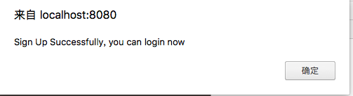
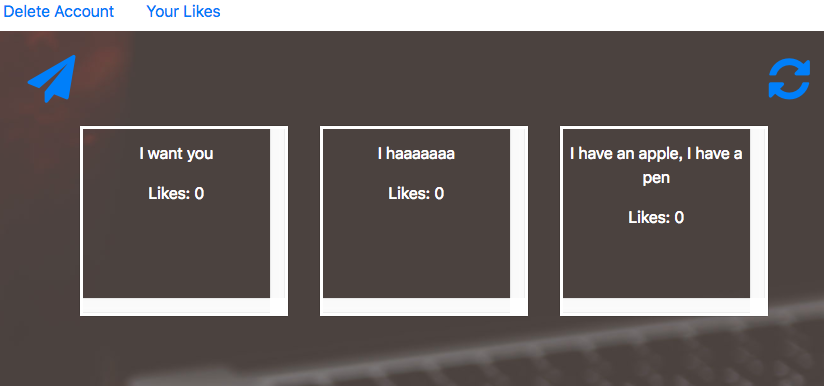
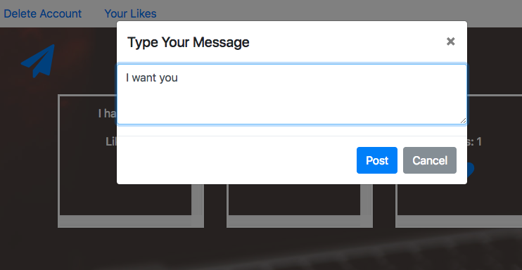
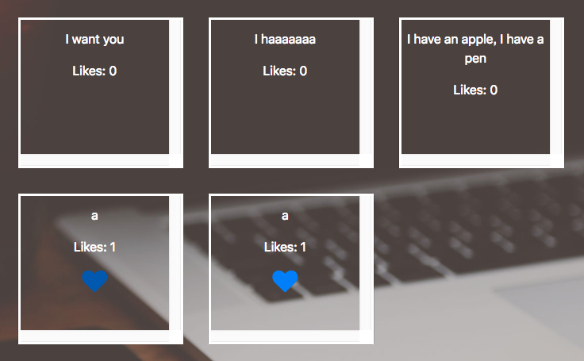
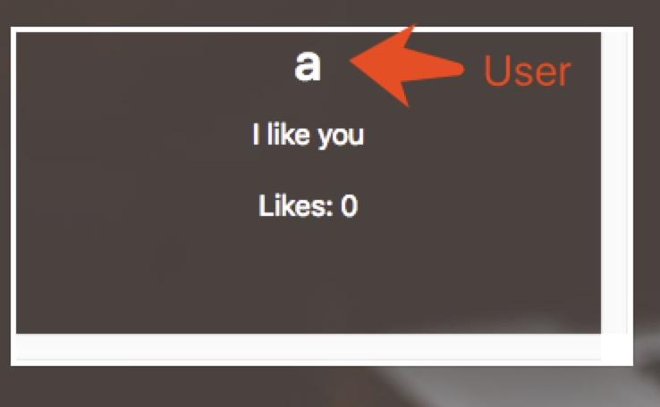
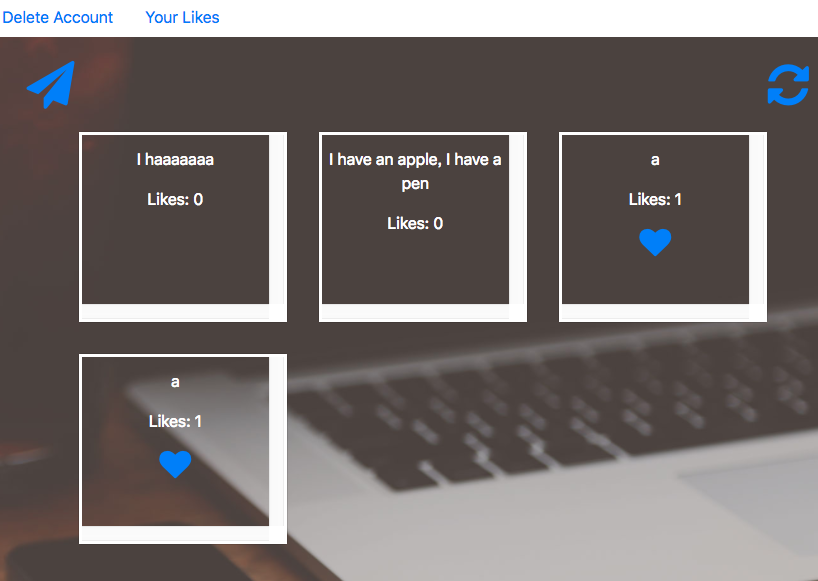
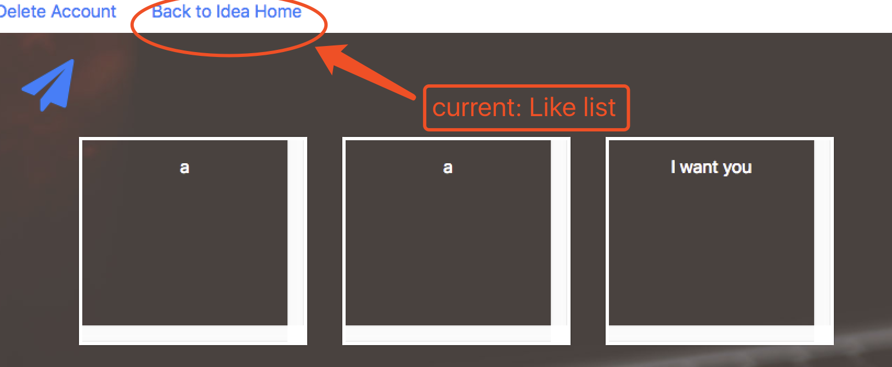
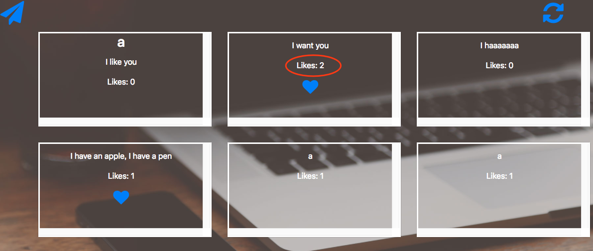

# DistributedWebApp
# Group members
## Changxing Cao
## Xinglun Xu

# How to Install the web application
1.  Install APIs we used:   
```
    go get github.com/gorilla/sessions    
```           


2.  Run the server:
```
    go run server.go      
```


3.  enter the website:        
    http://localhost:8080/index.html is the enter of the website.

4.  To run unit test:       
    We test Login Function, test Message is liked, test response and request in the web application Successfully !!                 
    use the command:         
    ```   
    go test
    ```

# Idea       
Time to create a fantastic product that will make you gazillions!!    
I think no one has ever come up with this idea before, so don't share it as we will be barraged with legal cases later on if you do.    
People are dying to share every little mindless thing they do throughout their lives, throughout their days, every minute. But given all that sharing, there isn't much time for actually saying much that's meaningful, so we can limit what they will say to a nice small fixed size, say 100 characters.   
The first stage of the overall project will be a simple web application, comprised of html and Go on a single machine. To further simplify matters, for this stage, you do not have to keep the information in files, instead just keepieverything in in-memory data structures. Note we are not using a database for this application.   
The second stage will involve splitting off the back end off to a separate server machine, implemented in Go and communication done via RPC and making sure to use goroutines.    
And finally, in the third stage, to improve reliability, we will replicate the server.    
What are the requirements for this application? You are designing the system, so aside from the description   
written above, much of the way the system works will be up to you. Clearly, there must be:    
Users who log in. They will need passwords. They may want to cancel their accounts. The ability to write / send the messages that the system is built for.    

# there are more features we add.       
1.  Show the user name of the message who sent it.
2.  Show the user the msgs their liked;
3.  Show the user how popular the msg is.(show how many people liked them)
4.  Show the msgs in the order of latest time;
5.  Show 3 msgs each time, and expand each time you click on the "expand" Button.


# Something you might Need to know in Golang Development
1.  Because Uppercase will be public, or it will be private! SO:
    In datasture, the var's first word must be Uppercase; Otherwise Json or other function will not get them. : )         
    Also, in Test function, the first one word must be Uppercase too!  
    Also, RPC's datasture first word must be Upper!
    Also, RPC's function is too.
2.  like.js cannot be recognized by js file. :) rename it!!!
3.  Create HttpTest case. Online's method is not clear. Use ours sample, it's easier.
4.  When you create a test case:					
	 a. see in the main file, which package you use					
	 b. name your test file with name "(#main_package)_test"						

## Picture of tests for each function:
1.  Login and sign up Main Page:              
      
   
2.  After Login, the home page will be :        
  
3.  Cancel their account function:              
    (delete account after their login)                  
       
    
4.   Write and send msg:            
         
     
5.  specify whose messages:                 
    For each message, we show the name of the user who sent the message;                  
           
6.  Like Function:            
    Click on the message, you will like this messages             
              
7.  Show all the message you Like           
      
8.  Show the message's like num (how many people liked this message)              
      
9.  Show all message by clicking the bottom button "expand"           
				
10. The result of Test:
