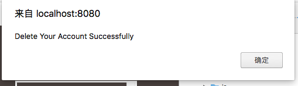

# DistributedWebApp(v 3.0)
# Group members
## Changxing Cao
## Xinglun Xu

# Explanation of Each files
***src/common*** is the data structure we use and communicate from server-front to server-end.   
      if you know RPC, this is go RPC. And store some certain Database Key-Value Map. Because RPC cannot use the datastructure in database file - db.go, so we put some into common.go  
***src/db***  is the back-end of the server, you can simply treat it as Database  
***server.go*** is the client of the server.    
***test file*** includes 1.main_test.go and 2.src/db/main_test.go    
      separately to test 1.Main FUNC ; 2.test DB logic and RPC communication   
***vrcode.go*** is the api of server replication, using ViewStamped Protocol to make sure consistency.  
***vrproxy.class*** is the api of client-server(front-end of server) to call function to the "vrcode" in the back-end.  
      (Notice this is for replication of the database, some easy website just communicate with DB, and leave the replication work to database technology)


# How to Install the web application
1.  Install APIs we used:   
```
    go get github.com/gorilla/sessions    
```           


2.  Run the server-frontend:
```
    go run server.go      
```

3.  Run the server-backend(Database): [removed in Version 3, you may not need to call this function]
```
    go run src/db/db.go
```

4.  Run the replicate server: (PBServer)

    We run three replication in this case:

    Please notice to enter parameter:
    -num=/0-3/  
    -port=/:8082-any/
```
    eg.
    go run src/db/vrcode.go -num=0 -port=:8082
    go run src/db/vrcode.go -num=1 -port=:8083
    go run src/db/vrcode.go -num=2 -port=:8084

```

5.  enter the website:        
    http://localhost:8080/index.html is the enter of the website.

6.  To run unit test:(Add more tests in version2)       
    We test Login Function, test Message is liked, test response and request in the web application Successfully !!                 
    use the command:         
    ```   
    go test
    ```


# Idea       
People are dying to share every little mindless thing they do throughout their lives, throughout their days, every minute. But given all that sharing, there isn't much time for actually saying much that's meaningful, so we can limit what they will say to a nice small fixed size, say 100 characters.   
The first stage of the overall project will be a simple web application, comprised of html and Go on a single machine. Implement a database with in-memory storage for this application.   
The second stage will involve splitting off the back end off to a separate server machine, implemented in Go and communication done via RPC.    
And finally, in the third stage, to improve reliability, we will replicate the server.    


# Here are some interesting features we add.       
1.  Show the user name of the message who sent it.
2.  Show the user the msgs their liked;
3.  Show the user how popular the msg is.(show how many people liked them)
4.  Show the msgs in the order of latest time;
5.  Show 3 msgs each time, and expand each time you click on the "expand" Button.
6.  With follow feature, users can filter messages from the users they are not following.


# Something you might need to Know in Golang Development
1.  Because Uppercase will be public, or it will be private! SO:
    In datasture, the var's first word must be Uppercase; Otherwise Json or other function will not get them. : )         
    Also, in Test function, the first one word must be Uppercase too!  
    Also, RPC's datasture first word must be Upper!
    Also, RPC's function is too.
2.  like.js cannot be recognized by js file. :) rename it!!!
3.  Create HttpTest case. Online's method is not clear. Use ours sample, it's easier.
4.  When you create a test case:					
	 a. see in the main file, which package you use					
	 b. name your test file with name "(main_package)_test"
5. 	Initialize RPC client "arith := &Arith" before http HandleFunc();   
6.  Notice to transfer the datastructure between client-server to vrcode, strong type data structure is not allowed in Golang.
7.  When you can not call class or function in the same package:    
    ```
    go run src/db/db.go src/db/vrcode.go -port=:8082 -num=0
    ```
8.  In part2, we use RPC to communicate, but we use differenct types;  
    In part3, commmand should use same RPC to communciate, so we need to revise a lot.  
    For better, You can do RPC in Part2 with the same RPC, DON't USE STRONG TYPE.


## Picture of tests for each function:
1.  Login and sign up Main Page:              
      
   
2.  After Login, the home page will be :        
  
3.  Cancel their account function:              
    (delete account after their login)                  
       
    
4.   Write and send msg:            
         
     
5.  specify whose messages:                 
    For each message, we show the name of the user who sent the message;                  
           
6.  Like Function:            
    Click on the message, you will like this messages             
              
7.  Show all the message you Like           
      
8.  Show the message's like num (how many people liked this message)              
      
9.  Show all message by clicking the bottom button "expand"           
				
10. The result of Test:
